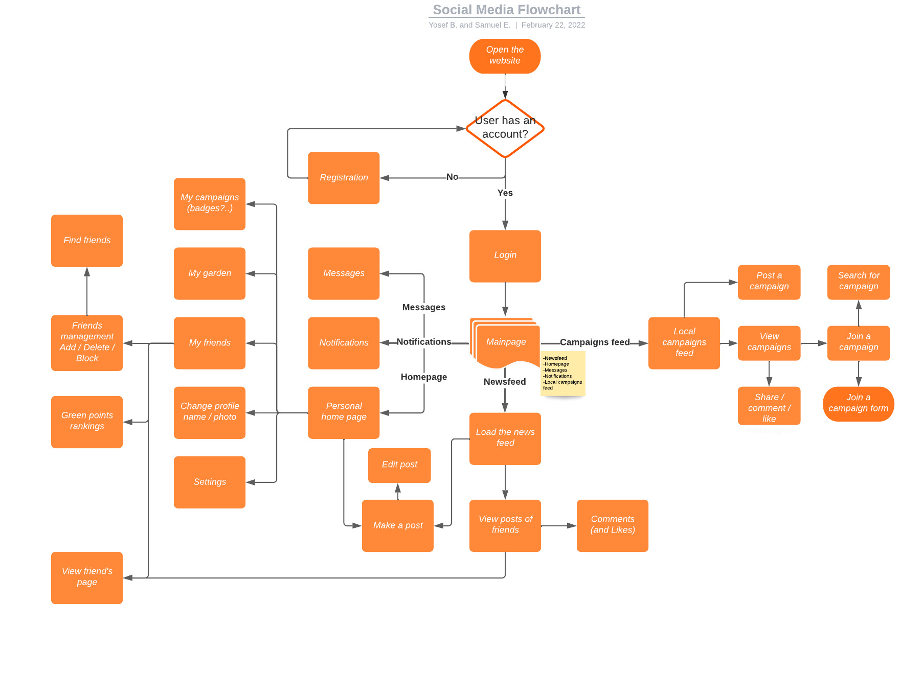

# Go Green

## What is this?
Go green is a social media network designed to promote sustainability via peer accountability, the sharing of ideas, and the creation of a community of like-minded individuals.

## Designs

[Figma Design](https://www.figma.com/file/oneaTemAgDEkEnQs9E0woj/GoGreen-Design?node-id=0%3A1&t=KY9QrOvmAMB41LSJ-0)

#### User Workflow
